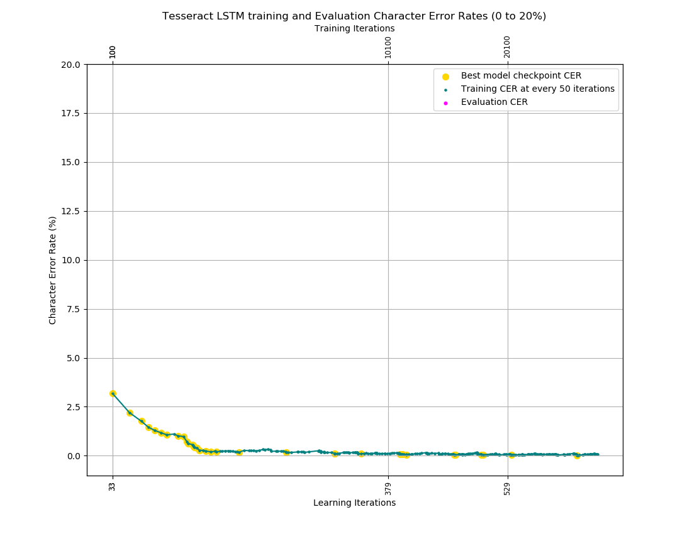
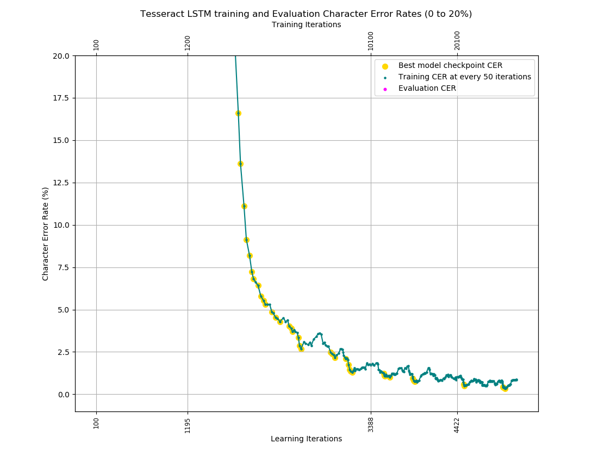

# Install Tesseract 5 on Ubuntu 18.04


## Uninstall Tesseract 3

If you have installed Tesseract 3, uninstall it by running the following commands

- Run `sudo make uninstall` in the `Tesseract` folder
- Remove the `Tesseract` folder
- Run `sudo rm -rf /usr/share/tesseract-ocr/`

## Download Tesseract OCR 5 source file

Go to the download page and download the lastest released file

[tesseract-5.0.0-rc1.tar](https://github.com/tesseract-ocr/tesseract/releases)

## Pre-requisites

The following libraries need to be installed

```shell
sudo apt-get install g++
sudo apt-get install autoconf automake libtool
sudo apt-get install pkg-config
sudo apt-get install libpng-dev
sudo apt-get install libjpeg8-dev
sudo apt-get install libtiff5-dev
sudo apt-get install zlib1g-dev
```

## Pre-requisites for training tools (Optional)

The following libraries need to be installed if you plan to install the training tools

```shell
sudo apt-get install libicu-dev
sudo apt-get install libpango1.0-dev
sudo apt-get install libcairo2-dev
```

## Install Developer Tools used for training

Run the following command if you wish to train custom dataset

```shell
sudo apt install libtesseract-dev
```

## Install Leptonica [link](https://github.com/chenghanc/Install-NVIDIA-Driver-CUDA-cuDNN-and-OpenCV/tree/tesseract3)

## Compile and run

Install Tesseract by running the following commands

```shell
./autogen.sh
./configure --prefix=/usr/share/tesseract-ocr/
make -j20
sudo make install
sudo ldconfig
```

## Set PATH (Optional)

```shell
echo "PATH=/usr/share/tesseract-ocr/bin:\$PATH" >> ~/.profile

source ~/.profile
```

## Check Version

Check version by running the following command

```shell
tesseract --version
```

## Build training tools

Build training tools by running the following commands

```shell
make training
sudo make training-install
```

## Language Data

- Download the data files `https://github.com/tesseract-ocr/tessdata`
- unzip the file and move to relevant folder

```shell
unzip tessdata.zip
sudo mv tessdata/* /usr/share/tesseract-ocr/share/tessdata/
```

- If you plan to fine-tune model from `xxxxx.traineddata`, download the **best** data files `https://github.com/tesseract-ocr/tessdata_best`
- unzip the file and move to relevant folder

```shell
unzip tessdata_best.zip
sudo mv tessdata_best /usr/share/tesseract-ocr/share/
```

- See [Segmentation fault when using integer models for LSTM training](https://github.com/tesseract-ocr/tesseract/issues/1573) for more informations
	- Only the **float models** in tessdata_best can be used for **lstmtraining**
	- Both tessdata and tessdata_fast have **integer models**

## Install Qt-box-editor (Optional) [link](https://github.com/chenghanc/Install-NVIDIA-Driver-CUDA-cuDNN-and-OpenCV/tree/tesseract3)

## Install jTessBoxEditor [link](https://github.com/chenghanc/Install-NVIDIA-Driver-CUDA-cuDNN-and-OpenCV/tree/tesseract3)

## Training Tesseract (Generate Training Images and Box Files)

Follow the instructions here [link](https://github.com/tesseract-ocr/tesstrain), [link](https://github.com/tesseract-ocr/tessdoc) and [link](https://github.com/livezingy/tesstrain-win)

<details><summary><b>CLICK ME</b> - Training Procedure</summary>

Before training your custom dataset, it is recommended to train [ocrd-testset.zip](https://github.com/tesseract-ocr/tesstrain/blob/main/ocrd-testset.zip) with sample ground truth first. This dataset consists of **line images** and **transcriptions**, line images have the extension `.tif`, transcriptions have the same name as the line images with the extension replaced by `.gt.txt` and must be single-line plain text. Download `tesstrain` by running the following command

```shell
git clone https://github.com/tesseract-ocr/tesstrain
```

Go to the folder `tesstrain` and extract `ocrd-testset.zip` to `./data/foo-ground-truth` and run `make training`. If the dataset can be trained normally, it means that the current training environment is OK and we can start to prepare custom dataset and perform training

**The output of successful training:**

```shell
Finished! Error rate = 1.134
lstmtraining \
--stop_training \
--continue_from data/foo/checkpoints/foo_checkpoint \
--traineddata data/foo/foo.traineddata \
--model_output data/foo.traineddata
Loaded file data/foo/checkpoints/foo_checkpoint, unpacking...
```

**Choose model name / Fine-tune / Ratio of training dataset:**

The default model name is `foo`

```shell
grep -nr MODEL_NAME .

...
./Makefile:19:MODEL_NAME = foo
...
```

We can give custom dataset a name when training model

```shell
make training MODEL_NAME=name_of_the_resulting_model

name_of_the_resulting_model=foo or hkid etc
```

The default model is trained from scratch, the `START_MODEL` in Makefile is assigned an empty string

```shell
grep -nr START_MODEL .

...
./Makefile:40:START_MODEL =
...
```

We can start fine-tuning from `eng.traineddata`

```shell
make training MODEL_NAME=name_of_the_resulting_model START_MODEL=eng TESSDATA=/usr/share/tesseract-ocr/share/tessdata_best MAX_ITERATIONS=10000
```

The ratio of training dataset is defined by the `RATIO_TRAIN` variable

```shell
grep -nr RATIO_TRAIN .

...
./Makefile:107:RATIO_TRAIN := 0.90
...
```

Run `make help` to see all the possible targets and variables

**Plotting:**

```shell
unzip ocrd-testset.zip -d data/ocrd-ground-truth
nohup make training MODEL_NAME=ocrd START_MODEL=frk TESSDATA=/usr/share/tesseract-ocr/share/tessdata_best/ MAX_ITERATIONS=10000 > plot/TESSTRAIN.LOG &
```

Download [plotting scripts](https://github.com/tesseract-ocr/tesstrain/tree/ee5f0d33ef96bc51a00a3452cb1c818a910bbff6)

```shell
cd plot
./plot_cer.sh
```

**PoC for MRZ** [Dataset](https://github.com/DoubangoTelecom/tesseractMRZ)

- Fine-tune from `tessdata_best/eng.traineddata`
	- Update the `xxx.numbers/xxx.punc/xxx.wordlist` in `data` folder
	- The three files should be consistent with the **base traineddata** from which you are fine-tuning
	- e.g. If you are fine-tuning from `eng.traineddata`, you could download `eng.numbers/eng.punc/eng.wordlist` from [langdata_lstm / eng](https://github.com/tesseract-ocr/langdata_lstm/tree/main/eng) and rename filenames separately: `mrz.numbers/mrz.punc/mrz.wordlist`

```shell
nohup make training MODEL_NAME=mrz START_MODEL=eng TESSDATA=/usr/share/tesseract-ocr/share/tessdata_best MAX_ITERATIONS=30000 > plot/TESSTRAIN.LOG &

Finished! Error rate = 0.021
```

The tree structure of the data folder

```shell
tree -L 2 data

data
├── eng
│   ├── mrz.lstm
│   ├── mrz.lstm-number-dawg
│   ├── mrz.lstm-punc-dawg
│   ├── mrz.lstm-recoder
│   ├── mrz.lstm-unicharset
│   ├── mrz.lstm-word-dawg
│   └── mrz.version
├── mrz
│   ├── all-gt
│   ├── all-lstmf
│   ├── checkpoints
│   ├── list.eval
│   ├── list.train
│   ├── mrz.charset_size=111.txt
│   ├── mrz.numbers
│   ├── mrz.punc
│   ├── mrz.traineddata
│   ├── mrz.unicharset
│   ├── mrz.wordlist
│   ├── my.unicharset
│   └── unicharset
├── mrz-ground-truth
│   ├── ...
│   ├── ...
│   ├── zahlen.jpg-2.box
│   ├── zahlen.jpg-2.gt.txt
│   ├── zahlen.jpg-2.lstmf
│   └── zahlen.jpg-2.tif
├── mrz.traineddata
└── radical-stroke.txt
```

Once the file `mrz.traineddata` is ready, you can copy it to `/usr/share/tesseract-ocr/share/tessdata/`

Character Error rate:



- Train from scratch

```shell
nohup make training MODEL_NAME=mrzscratch MAX_ITERATIONS=30000 > plot/TESSTRAIN.LOG &

Finished! Error rate = 0.344
```

Character Error rate:



- Check and test

```shell
tesseract --list-langs

tesseract 20211101311.jpg stdout -l mrz
```

- **Note:** Images must be **TIFF** with the extension `.tif` or **PNG** with the extension `.png`
	- **Use mogrify tool for batch processing:** `mogrify -format tif *.jpg`

- **Note:** How to prepare dataset
	- Use this tip [@Shreeshrii's shell script](https://github.com/tesseract-ocr/tesstrain/issues/7#issuecomment-419714852) to generate line images for transcriptions from a full page


</details>


---

## References

1. [tesseract3](https://github.com/chenghanc/Install-NVIDIA-Driver-CUDA-cuDNN-and-OpenCV/tree/tesseract3)
2. [improve quality](http://coddingbuddy.com/article/51897036/how-can-i-improve-tesseract-results-quality)
